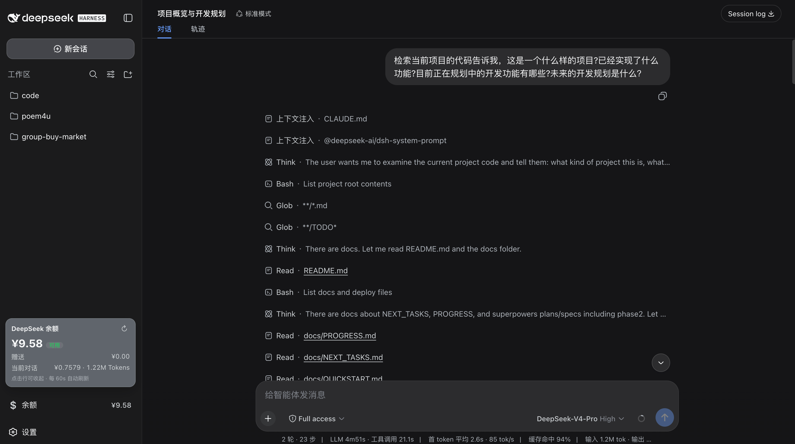

# dsh-deepseek-balance-cn

> DeepSeek Harness（`dsh`）Web GUI 插件：在**侧边栏底部（设置入口上方）**显示 DeepSeek API 余额，点击展开详情。

> npm 包名 `dsh-deepseek-balance-cn`。原名 `dsh-deepseek-balance` 已被他人占用
> （见 https://www.npmjs.com/package/dsh-deepseek-balance —— 那是另一位作者的插件）。
> **包名必须与三处自引用完全一致**，否则 `dsh` 启动或插件加载会失败，详见「包名一致性」。

基于 [DeepSeek Harness](https://github.com/deepseek-ai/deepseek-harness) 的插件架构（一切皆插件）编写，纯 JavaScript、零构建步骤。

## 截图



## 功能

- **左下角入口**：`$` 图标 + “余额”标签，风格与“设置”入口对齐（间距、高度、圆角一致）
- **点击展开详情**：总余额、可用状态、赠送余额、当前对话费用
- **当前对话费用**：Host 侧按官方价格表对每条消息实时计价，并回放持久化日志（重启后历史费用不丢失）
- **手动 + 自动刷新**：详情面板内置 ↻ 刷新按钮；余额每 60s、对话费用每 5s 自动刷新
- **响应式**：详情面板宽度跟随侧边栏拉伸；窄栏（56px rail）下只显示 `$` 图标
- **明暗主题**：全部使用 `--dsw-*` 设计 token，自动跟随浅色/深色模式
- **安全**：API key 只在 Host 侧解析，浏览器拿不到明文

## 安装

### 方式一：从 npm

```sh
dsh plugin --profile web add dsh-deepseek-balance-cn
```

### 方式二：本地安装

```sh
git clone https://github.com/angus-guo/dsh-deepseek-balance.git
cd dsh-deepseek-balance
dsh plugin --profile web add .
```

安装后重启并刷新页面：

```sh
dsh --profile web
```

> 浏览器侧 bundle 在 `dsh --profile web` 重启时重新生成，请**硬刷新**页面（`Cmd + Shift + R`）。

> 若默认端口 3080 已被占用，会报 `EADDRINUSE`。换端口或让系统自选：

```sh
dsh --profile web --port 3081
dsh --profile web --port 0      # 由操作系统挑一个空闲端口
```

### 前置条件

- 已在 **设置 → 模型** 中配置 DeepSeek API Key（存储在 `~/.dsh/.credentials.yaml`，或通过环境变量 `DEEPSEEK_API_KEY` 提供）。

## 包名一致性（重要）

`dsh` 的插件包名参与**三处互相独立的解析**，任何一处不一致都会导致启动失败或插件静默不加载：

| 位置 | 字段 | 被谁使用 | 不一致时的症状 |
|---|---|---|---|
| `cordis.patch.yml` | `name:` | cordis loader 的 `import()` 说明符，从 profile 目录解析 | **`dsh` 直接启动失败**：`Cannot find package '...' imported from ~/.dsh/profiles/web/` |
| `src/client.js` | `window.__ModuleLoader__.load({ id })` | 浏览器端模块表键；Host 侧 boot graph 用**包名**建行 | 启动正常但插件不渲染：`loaded without registering "<包名>" via __ModuleLoader__.load` |
| `package.json` | `name` | npm 安装名 + 上述两者的基准 | 与 `cordis.patch.yml` 不一致即触发第一种失败 |

`src/index.js` 的 `export const name` 只是 cordis 插件的标识名，不参与解析，但同样应保持一致。

## 使用

- 侧边栏底部会多出一行 **`$ 余额`**（位于“设置”上方），右侧显示当前总余额。
- **点击**该行展开详情面板，再次点击收起。
- 详情面板字段：

| 字段 | 含义 | 来源 |
|---|---|---|
| 余额（大字） | 总余额 | `/user/balance` |
| 可用 / 不可用 | 账户是否可调用 API | `/user/balance` 的 `is_available` |
| 赠送 | 赠送（赠金）余额 | `/user/balance` 的 `granted_balance` |
| 当前对话 | 当前会话累计费用 + token 数 | 本地按价格表计价 |

## 数据来源

- **余额**：DeepSeek 公开接口 [`GET /user/balance`](https://api-docs.deepseek.com/api/get-user-balance/)。
- **当前对话费用**：订阅 `session/event`，对每条 `assistant/message` 按 `TokenUsage × 单价 / 1M` 计价，并回放持久化日志补齐重启前的历史。

## 价格表

价格数据维护在 [`src/pricing.js`](src/pricing.js)，整理自 [DeepSeek 官方定价页](https://api-docs.deepseek.com/zh-cn/quick_start/pricing/)。含峰谷定价（北京时间 9:00–12:00、14:00–18:00 为高峰）。官方调价时更新 `RATES` 即可。

## 目录结构

```
src/
├── index.js      # Host 半：/api/quota（余额）+ /api/quota/session（会话费用）
├── pricing.js    # 价格表 + 峰谷判定 + 计价
└── client.js     # 浏览器半：侧边栏底部入口 + 详情面板
cordis.patch.yml  # bundle patch 层
```

## 更新日志

### 0.1.1

- **修复**：`cordis.patch.yml` 的 `name` 仍是改名前旧名 `dsh-deepseek-balance`，导致 `dsh` 启动即失败
  （`Cannot find package 'dsh-deepseek-balance'`）。0.1.0 在任何环境下都无法启动。
- **修复**：`src/client.js` 的 `window.__ModuleLoader__.load({ id })` 同样是旧名，会让插件在浏览器端
  加载失败（`loaded without registering`）。
- 统一 `package.json` / `cordis.patch.yml` / `src/index.js` / `src/client.js` 四处包名。

## 已知限制

- 计价仅按 CNY 单价；USD 账户的余额按 `currency` 显示符号，费用仍按 CNY 计。
- 价格表只维护当前价格（不含历史调价），用于“当前对话费用”的近似计算。
- 会话费用只统计**本机 dsh 会话**的消费，不含 platform 网页或其他工具的消费。

## License

[MIT](LICENSE)
